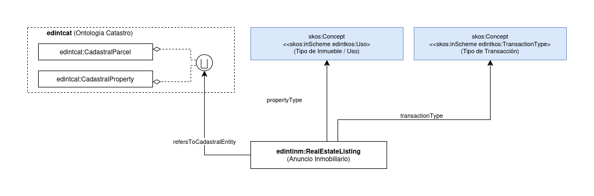

# Ontología de Oferta Inmobiliaria Española

Esta ontología permite representar el dominio de las ofertas inmobiliarias en el contexto español, centrada en anuncios inmobiliarios (venta, alquiler, traspaso) y su relación con entidades catastrales.

Está siendo desarrollada en el contexto del Espacio de Datos para las Infraestructuras Urbanas Inteligentes ([EDINT](https://edint.es)).

# Propósito y alcance de la ontología

El propósito de esta ontología es modelar las ofertas inmobiliarias en el contexto español para habilitar la interoperabilidad de datos en el ámbito de la oferta inmobiliaria. El alcance se limita a anuncios inmobiliarios, tipos de inmueble, tipos de transacción y su relación con entidades catastrales. Quedan fuera del alcance aspectos como valoración de inmuebles, procesos de intermediación, contratos y datos financieros.

# Prefijo y espacio de nombres

El prefijo de esta ontología es `edintinm`. Se publica en el espacio de nombres: http://vocab.linkeddata.es/datosabiertos/def/oferta-inmobiliaria/

# Modelo conceptual (Ontology conceptualization)

# Estructura del repositorio (Repository structure)

| Carpeta | Descripción |
|--------|--------------|
| **diagrams/**     | Almacena diagramas y otros recursos que representan el modelo conceptual de la ontología (por ejemplo, jerarquías de clases, relaciones).                                     |
| **documentation/**         | Almacena la documentación HTML u orientada a humanos de la ontología y artefactos relacionados.                                                                               |
| **examples/**     | Incluye ejemplos que demuestran cómo instanciar o aplicar la ontología en escenarios de datos reales.                                                                         |
| **kos/**          | Almacena vocabularios controlados o implementación de KOS, generalmente implementaciones SKOS en RDF (tipos de transacción, usos de inmueble).                                                                         |
| **ontology/**     | Contiene los archivos de implementación reales de la ontología en formatos como `.owl`, `.rdf`, `.ttl` o `.jsonld`.                                                           |
| **requirements/** | Contiene todos los documentos utilizados para definir los requisitos de la ontología: ejemplos de datos, preguntas de competencia, requisitos funcionales, casos de uso, etc. |
| **shapes/**       | Contiene los SHACL shapes utilizadas para definir y validar las restricciones de la ontología.                                                                                |

# Mantenimiento y evolución (Maintenance and evolution)

Para manejar las incidencias o mejoras sugeridas con respecto a la ontología, recomendamos seguir las guías proporcionadas en ([Issues Management](./ISSUES.md)) para generar una incidencia.

# Financiación (Funding)

Esta ontología ha sido desarrollada en el contexto del Espacio de Datos para las Infraestructuras Urbanas Inteligentes ([EDINT](https://edint.es)).

